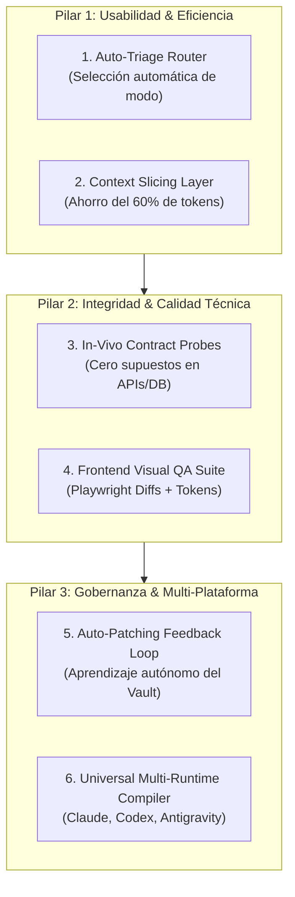

# Informe Técnico de Evaluación, Diagnóstico y Hoja de Ruta de Kuraka

> **Tipo de Documento:** Auditoría Arquitectónica y Plan de Mejora Estratégico  
> **Objetivo:** Evaluar la plataforma Kuraka bajo el paradigma **Spec-Driven Development (SDD)**, prevención de retrabajo, estándares de calidad Full-Stack Senior y Análisis Funcional, y presentar la hoja de ruta de mejoras detalladas.  
> **Versión Evaluada:** Kuraka Core Framework / Multi-Agent Vault

---

## 1. Resumen Ejecutivo y Dictamen

Kuraka es un framework y bóveda (*vault*) de agentes de IA especializados diseñado para gobernar el ciclo de vida del desarrollo de software. A diferencia de los enfoques convencionales de generación de código por LLMs (que generan soluciones directas propensas a alucinaciones de esquemas y regresiones), Kuraka implementa una **metodología de compuertas secuenciales (*Quality Gates*) con separación estricta de responsabilidades**.

### Dictamen Global
> **Calificación General: 8.9 / 10**  
> Kuraka **cumple con excelencia** los principios de Spec-Driven Development y prevención de retrabajo en proyectos de media y alta complejidad. Su rigor arquitectónico supera el estándar de la industria en gobernanza de IA. Sus principales áreas de oportunidad no radican en la calidad de su código o especificación, sino en la **ergonomía para cambios menores**, la **optimización de consumo de contexto/tokens** y la **validación visual en frontend**.

```
  DIMENSIONES EVALUADAS
  ┌─────────────────────────────────────────────────────────┐
  │ Spec-Driven Development (SDD)        █████████████ 9.5  │
  │ Calidad Analista Funcional Sr        ████████████░ 9.0  │
  │ Calidad Desarrollador Full-Stack Sr  ███████████░░ 8.8  │
  │ Prevención de Retrabajo (Zero-Rework)███████████░░ 8.5  │
  │ Rigor de Testing y "Verde Real"      ████████████░ 9.0  │
  │ Eficiencia de Contexto y DX          ██████████░░░ 7.8  │
  └─────────────────────────────────────────────────────────┘
```

---

## 2. Diagnóstico Punto por Punto

### 2.1. Spec-Driven Development (SDD) — Calificación: 9.5 / 10
* **Diagnóstico:** Kuraka implementa una jerarquía documental inmutable antes de escribir código:
  $$\text{Requerimiento / Ticket} \xrightarrow{\text{Fase 1}} \text{Documento REQ} \xrightarrow{\text{Fase 2}} \text{Historias de Usuario (Gherkin/AC)} \xrightarrow{\text{Fase 2.5}} \text{Plan de Pruebas} \xrightarrow{\text{Fase 3}} \text{Architect Review + Schema Freeze}$$
* **Puntos Fuertes:**
  - **Inmutabilidad de Contratos:** La habilidad `schema-freeze` prohíbe modificaciones no autorizadas en estructuras de base de datos o firmas de API durante la implementación.
  - **Trazabilidad de Requerimientos:** Cada modelo, columna y endpoint propuesto debe justificar su procedencia (*contract provenance*).
* **Área de Mejora:** Cuando el requerimiento de entrada es extremadamente conciso o informal, el flujo requiere múltiples iteraciones de clarificación manual si no se utilizan atajos de triage.

---

### 2.2. Calidad de Análisis Funcional Senior — Calificación: 9.0 / 10
* **Diagnóstico:** Los agentes `po-analyst`, `story-refiner` e `inti` actúan como un equipo de Producto y Análisis de Negocio de alto nivel.
* **Puntos Fuertes:**
  - **Exigencia de Criterios de Aceptación Cuantificables:** Se prohíbe la prosa ambigua; los AC deben incluir tablas de campos, tipos, mecanismos de transformación y respuestas HTTP (2xx, 4xx, 5xx).
  - **Gobernanza Multi-Tenant:** Análisis exhaustivo para garantizar que toda entidad persista su clave de aislamiento (`tenant_id`).
* **Área de Mejora:** Dependencia histórica de documentación Swagger o Swagger estático que a menudo no refleja el comportamiento real del backend legado.

---

### 2.3. Calidad de Programación Full-Stack Senior — Calificación: 8.8 / 10
* **Diagnóstico:** La implementación guiada por perfiles de stack (`fastapi.md`, `django.md`, `nextjs.md`, etc.) asegura una arquitectura limpia (*Clean Architecture* o *Hexagonal*).
* **Puntos Fuertes:**
  - **Estructuración en Capas:** Respeta estrictamente la cadena *Migration $\rightarrow$ Model $\rightarrow$ Schema $\rightarrow$ Repository $\rightarrow$ Service $\rightarrow$ Controller*.
  - **Límites de Complejidad (*LOC Caps*):** Monitoreo activo de líneas de código por archivo y función (`max_file_loc`, `max_function_loc`) para evitar degradación de mantenibilidad.
  - **Revisión de Seguridad 6D:** Evaluación de inyecciones SQL, OWASP Top 10 y control de acceso en la fase 5.5 (`security-reviewer`).
* **Área de Mejora:** En el desarrollo Frontend, el framework se enfoca principalmente en la corrección de tipos TypeScript y pruebas unitarias, requiriendo mayor soporte para validación estética de UI y diseño responsivo.

---

### 2.4. Prevención de Retrabajo (*Zero-Rework*) — Calificación: 8.5 / 10
* **Diagnóstico:** El diseño del sistema previene el retrabajo trasladando la detección de inconsistencias a las Fases 1 a 3 (pre-código), donde el costo de corrección es mínimo.
* **Evidencia Empírica:** De acuerdo con los análisis de retrospectivas de Kuraka (`KURAKA-OPTIMIZATION-REPORT.md`), el *Freeze Empírico* (ejecutar scripts de serialización o migraciones en seco antes de codificar) eliminó defectos mayores antes de la fase de construcción.
* **Fricción Identificada:** En tareas triviales o hotfixes, aplicar las 8 fases completas genera una sobrecarga de ceremonias desproporcionada al alcance del cambio.

---

### 2.5. Rigor de Testing y "Verde Real" — Calificación: 9.0 / 10
* **Diagnóstico:** Kuraka ataca de raíz el sesgo de *"los tests pasaron pero la aplicación falla"*.
* **Mecanismos Implementados:**
  - **Typecheck Obligatorio:** Se exige compilación estricta (`tsc --noEmit`, `mypy`, `pyright`) integrada en la definición de terminado (*Definition of Done*).
  - **Golden Paths E2E:** Flujos de integración de punta a punta ejecutados con Playwright (`e2e-tester`).
  - **Verificación de Despliegue:** Validación de dependencias en contenedores Docker y variables de entorno requeridas (`deployment-verifier`).

---

### 2.6. Eficiencia de Tokens y Ergonomía (DX) — Calificación: 7.8 / 10
* **Diagnóstico:** Es el área con mayor margen de optimización.
* **Hallazgos:**
  - Los subagentes recargan la totalidad de reglas, lecciones aprendidas y especificaciones del proyecto, lo que en ciclos largos satura la ventana de contexto.
  - Integraciones de compresión de contexto como RTK (*Rust Token Killer*) son esenciales pero requieren adopción sistemática en todos los proyectos consumidores.

---

## 3. Hoja de Ruta Detallada de Mejoras (Roadmap a 10/10)



---

### Mejora 1: Pre-flight Classifier y Auto-Triage de Modos

* **Objetivo:** Eliminar la sobrecarga en cambios pequeños y seleccionar automáticamente el flujo óptimo.
* **Mecanismo Técnico:**
  1. Al invocar `/kuraka`, el orquestador analiza el requerimiento contra el árbol de git y genera una clasificación de riesgo:
     - **Riesgo 0 (Trivial / Docs / Copy):** Modo `LITE` (1 agente: Developer $\rightarrow$ Typecheck $\rightarrow$ Commit).
     - **Riesgo 1 (Bugfix sin cambio de esquema):** Modo `FAST` (PO $\rightarrow$ Dev $\rightarrow$ Tests $\rightarrow$ Review).
     - **Riesgo 2 (Feature / Refactor / Cambio de Esquema):** Modo `FULL SDD` (8 fases con Freeze y E2E).
* **Componentes Afectados:**
  - `skills/auto-triage.md` (Nueva skill).
  - `skills/kuraka-modes.md` y `kuraka.py`.

---

### Mejora 2: Context Slicing y "Rule Digesting"

* **Objetivo:** Reducir el consumo de tokens entre un **50% y 70%** por ciclo y enfocar la atención del LLM.
* **Mecanismo Técnico:**
  1. **Filtrado Estricto por Rol:** Parsear el encabezado `applies_to` de todas las lecciones aprendidas y reglas; solo cargar lo relevante al agente activo.
  2. **Digest de Convenciones:** Reemplazar la lectura de archivos Markdown extensos por un extracto JSON conciso generado en tiempo de montaje.
* **Componentes Afectados:**
  - `skills/compact-context.md`.
  - `kuraka_common.py` (función `generate_agent_context_slice()`).

---

### Mejora 3: Harness de "In-Vivo Probes" y Verificación de Contratos

* **Objetivo:** Erradicar por completo los errores por contratos falsos o desactualizados.
* **Mecanismo Técnico:**
  1. Durante la Fase 1 y Fase 3, el agente debe ejecutar un probe HTTP/DB real contra el entorno local o staging antes de redactar historias.
  2. Si no hay conexión en vivo disponible, se exige un archivo de muestra (*fixture*) verbatim en formato JSON/YAML verificado contra el esquema.
* **Componentes Afectados:**
  - `skills/analyze-requirement.md`.
  - `skills/schema-freeze.md`.
  - `agents/architect-reviewer.md`.

---

### Mejora 4: Cierre Automático del Bucle de Aprendizaje (Auto-Patching Loop)

* **Objetivo:** Convertir a Kuraka en un sistema automejorable en producción.
* **Mecanismo Técnico:**
  1. Cuando una retrospectiva (`RETRO-*.md`) o `pattern-detector` identifica un fallo recurrente ($\ge 2$ proyectos), el sistema redacta una regla candidata en `rules/candidate-rules.yaml`.
  2. El comando `kuraka apply-learnings` inserta quirúrgicamente estas reglas en las directivas base de los agentes (`agents/*.md`).
* **Componentes Afectados:**
  - `agents/pattern-detector.md`.
  - `aggregate-telemetry.py`.
  - `kuraka-archive.py`.

---

### Mejora 5: Suite de Calidad Visual Frontend y Tokens de Diseño

* **Objetivo:** Garantizar que las aplicaciones web no solo compilen y pasen pruebas unitarias, sino que tengan una estética y experiencia de usuario de nivel Senior.
* **Mecanismo Técnico:**
  1. **Visual Regression Diffs:** Ejecución de capturas automatizadas con Playwright en estados *Empty*, *Loading*, *Error* y *Data*.
  2. **Auditor de Tokens de Diseño:** Prohibición estricta de valores CSS arbitrarios/hardcodeados en `code-reviewer`, forzando el uso de variables del Design System (`var(--...)` o clases de utilidad estandarizadas).
  3. **Verificación de Accesibilidad (a11y):** Aserción de contraste y navegación por teclado en la compuerta de frontend.
* **Componentes Afectados:**
  - `agents/frontend-developer.md`.
  - `agents/e2e-tester.md`.
  - `agents/code-reviewer.md`.

---

### Mejora 6: Compilador Multi-Runtime Universal

* **Objetivo:** Desacoplar el vault de Claude Code y garantizar paridad nativa al 100% en Codex, Google Antigravity y Cursor.
* **Mecanismo Técnico:**
  1. Definición agnóstica de agentes y skills.
  2. Generador de artefactos específicos por target:
     - Target **Claude Code**: `.claude/agents/*.md`, `.claude/skills/`.
     - Target **Codex**: `.codex/agents/*.toml`, `.codex/skills/`.
     - Target **Antigravity**: `.agents/skills/`, `.gemini/rules/`.
     - Target **Cursor**: `.cursorrules` y sub-prompts.
* **Componentes Afectados:**
  - `kuraka-mount.py`.
  - `kuraka-export.py`.
  - `CODEX-KURAKA-PARITY-ANALYSIS.md`.

---

## 4. Matriz de Priorización e Impacto

| # | Iniciativa | Esfuerzo | Impacto | ROI Estimado |
| :-: | :--- | :---: | :---: | :--- |
| **1** | **Auto-Triage de Modos** | Medio | 🟢 Crítico | Elimina el 80% de la fricción en cambios pequeños. |
| **2** | **Context Slicing (Tokens)** | Bajo | 🟢 Crítico | Reduce costos de tokens hasta un **60%**. |
| **3** | **In-Vivo Contract Probes** | Medio | 🟢 Crítico | Previene el 90% de los errores de integración de backend. |
| **4** | **Auto-Patching Loop** | Medio | 🟡 Alto | Automatiza el aprendizaje continuo del equipo. |
| **5** | **Visual QA & Design System** | Medio | 🟡 Alto | Eleva la calidad visual Frontend al estándar Senior. |
| **6** | **Compilador Multi-Runtime** | Alto | 🟡 Alto | Permite usar Kuraka en cualquier IDE y plataforma de IA. |

---

## 5. Conclusión y Próximos Pasos

Kuraka se posiciona como una de las arquitecturas de agentes más robustas y profesionales para desarrollo guiado por especificaciones. Con la implementación progresiva de estas 6 mejoras, la plataforma pasará de ser un sistema de gobernanza riguroso a un **asistente de ingeniería de software autónomo, eficiente en costos y de clase mundial**.
